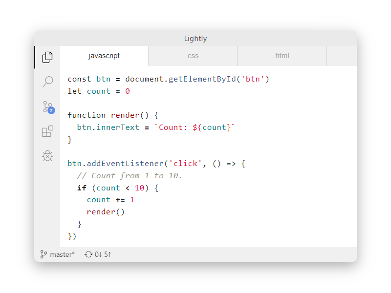

# Lightly

Simple light theme for VSCode 
based on [Atom Light](https://github.com/atom/atom/tree/master/packages/atom-light-syntax) syntax theme and [Atom One Light](https://github.com/atom/atom/tree/master/packages/one-light-ui) UI theme

